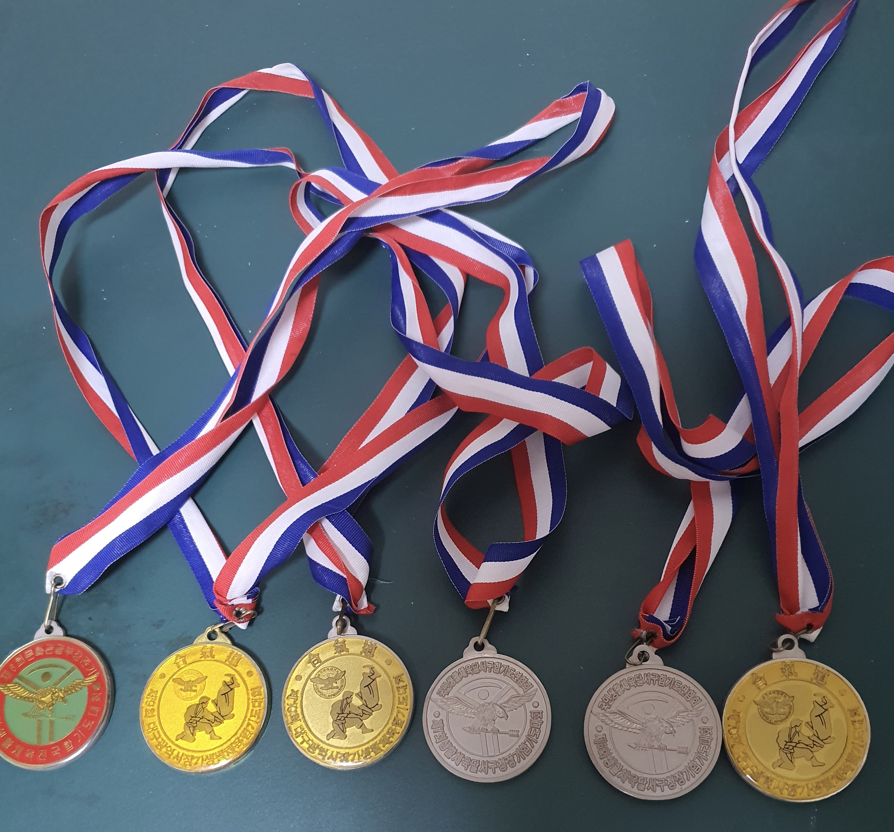

# 🦔 Introduction

* 학창시절 부터 육상, 합기도 시합 출전, 체대 입학 이후 스키 대한스키지도자연맹(KISA) 레벨 2 준지도자 강사 및 수상 인명 구조원 자격증 취득 및 활동 &#x20;

<figure><figcaption>
학창시절 합기도 메달들
</figcaption></figure>

* 친구의 권유로 Queens College의 Hackattack 해커톤에 참가하며 프로덕트를 만드는 과정을 경험. 이를 계기로 개발자로서 도전



### 📖 2024 읽은 책&#x20;

* 소프트 웨어 장인
* 함께자라기
* 리액트 훅을 활용한 마이크로 상태관리
* 모던 리액트 Deep Dive
* 쏙쏙 들어오는 함수형 코딩
* 코어 자바스크립트

### 🚀  오픈 소스 활동

[https://github.com/mui/mui-x](https://github.com/mui/mui-x) contributor



[https://github.com/vercel/turbo](https://github.com/vercel/turbo) contributor



[https://github.com/twentyhq/twenty](https://github.com/twentyhq/twenty) contributor



[https://github.com/HarshdipD/eztrackr](https://github.com/HarshdipD/eztrackr) contributor hacktoberfest 참가


