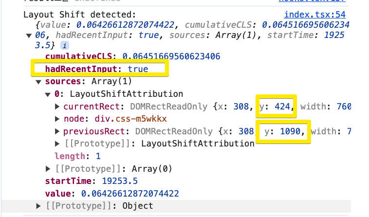

# layout shift 측정 가능한 성능 지표와 실제 사용자 경험 사이의 차이

### 레이아웃 시프트 점수

* 목표 CLS 점수: 0.1 이하
  * 이는 구글이 '좋은' 사용자 경험을 위해 권장하는 점수이다.
* 측정 기준: 75번째 백분위수
  * 100번의 페이지 로드 중 75번은 0.1 이하의 CLS를 기록해야 합니다.

### 영향 비율

* _불안정한 요&#xC18C;_&#xAC00; 두 프레임 사이에서 viewport에 얼마나 영향을 미치는지 측정 하는 지표 이다.
* 현재 프레임과 이전 프레임에서 모든 불안정한 요소들의 보이는 영역의 합 / 전체 뷰포트 영역
* 왼쪽의 회색 배경을 가진 text element가 처음에 뷰포트의 절반을 차지하고 있다가, 다음 프레임에서 뷰포트 높이의 25% 만큼 아래로 이동했다.
* 빨간 점선 사각형은 두 프레임에서 이 요소가 차지한 전체 영역을 나타내는데 전체 뷰포트의 75%차지 한다. 그래서 영향 비율은 0.75가 된다.


<figure><figcaption></figcaption></figure>

### 거리 비율

* 불안정한 요소들이 뷰포트에 비해 얼마나 멀리 이동 했는지 측정한다.
* (불안정한 요소의 최대 이동 거리) / (뷰포트의 가장 큰 치수)
* 최대 이동거리는 가로세로 포함 이며 뷰포트 또한 넓이와 높이를 포함해 가장 높은 치수를 바탕으로 계산한다.
* 위 이미지의 예제에서는 불안정한 요소가 세로로 뷰포트 높이의 25%만큼 이동 했다.
* 결과: 거리 분율은 0.25

계산: 0.75 × 0.25 = 0.1875


### 움직인다고 모든게 불안정한 요소에 포함되는건 아니다. ?


위에서 언급했듯이 'layout-shift' 이벤트를 통해 레이아웃 변화를 관찰하는 대상이 불안정한 요소인데, 움직인다고 해서 모든게 불안정한 요소로 layout-shift 측정에 포함되는건 아니다.


<figure><figcaption></figcaption></figure>


두 프레임간의 가시적 변화에 대한 시나리오는 다음과 같다.

* 기존의 회색 상자 하단에 새로운 버튼을 추가한다.
* 이로 인해 녹색 상자가 아래로 밀려나고, 일부가 뷰포트 밖으로 나간다.

여기서 유의있게 볼 점은 회색배경을 가진 Element는 불안정한 요소가 아니다.

**그 이유는 크기는 변경되지만 시작 위치는 변하지 않아 '불안정 요소'로 간주되지 않는다.**

* "Click Me!" 버튼은 이전에 DOM에 없었으므로 시작 위치 변화가 없다.
* 녹색 상자: 시작 위치가 변경되어 '불안정 요소'로 간주된다.
* Impact Fraction 계산:
  * 녹색 상자의 일부가 뷰포트 밖으로 나갔지만, 보이지 않는 영역은 계산에서 제외된다.
  * 두 프레임에서 녹색 상자의 가시 영역 합집합(빨간 점선 사각형으로 표시)은 첫 번째 프레임의 녹색 상자 면적과 같다.
  * 이 면적은 뷰포트의 50%를 차지한다.
  * 따라서 Impact Fraction은 0.5
* Distance Fraction 계산:
  * 보라색 화살표로 표시된 이동 거리를 나타낸다.
  * 녹색 상자가 뷰포트 높이의 약 14% 만큼 아래로 이동한다.
  * 따라서 Distance Fraction은 0.14&#x20;
* 레이아웃 시프트 점수 계산:
* 계산식: Impact Fraction x Distance Fraction
* 0.5 x 0.14 = 0.07


### 그래서 모든 레이아웃 변화가 나쁘진 않다

* 레이아웃 이동은 사용자가 예상하지 못한 경우에만 나쁜 영향을 미친다.
* 예상하지 못한 경우는 어떤 경우인가? 누구 입장에서 예상하지 못한다는거지? 그리고 나쁜 영향은 구체적으로 어떤 의미일까?
* 그리고 여기서 언급되는 예상하지 못한 경우의 레이아웃 시프트는 CLS에 축적이 되는 지표인가?
* 사용자 시작 레이아웃 시프트:
  * 사용자 상호작용(링크클릭, 버튼, 검색창 입력) 에 대한 응답으로 발생하는 레이아웃 시프트는 상호작용과 충분히 가까운 시간내에 발생하여 그 관계를 명확히 인지할 수 있다면 일반적으로 괜찮다.


### CLS의 한계와 사용자 경험

CLS 점수가 웹페이지의 시각적 안정성을 측정하는 목적이며 이상적으로 본다면 예기치 않은, 사용자를 방해하는 레이아웃 변화만을 포착하려고 한다. 하지만 항상 실제 사용자 경험을 정확히 반영하지는 않는다.

자료에 의하면,

> "이 메트릭에 의해 정의된 '레이아웃 불안정성'의 존재는 '점프하는' 웹사이트의 사용자 경험과 불완전하게 연관됩니다.

* 낮은 CLS 점수, 나쁜 사용자 경험의 예:
  * 웹사이트가 "점프"하는 것처럼 보이지만 CLS 점수가 좋을 수 있다.
  * 예: DOM을 완전히 새로운 요소로 재구성하는 경우, 이는 레이아웃 시프트를 트리거하지 않는다.
  * 이는 CLS가 포착하지 못하는 사용자 경험의 변화가 있을 수 있음을 의미합니다.
* 높은 CLS 점수, 좋은 사용자 경험의 예:
  * 반대로, 웹사이트가 부드러운 사용자 경험을 제공하지만 CLS 점수가 나쁠 수 있습니다.
  * 예: `left` 속성을 사용하여 애니메이션되는 이미지 캐러셀은 애니메이션의 각 프레임마다 레이아웃 시프트를 발생시킵니다.
  * 해결책: 캐러셀 제작자는 `transform`을 사용해야 합니다. 이는 레이아웃 시프트를 피하고 스레드 외 가속 컴포지팅을 가능하게 합니다.
* cls 는 일부 레이아웃 변화를 좋은 변화로 간주하고 점수계산에서 제외하려는 노력을 합니다.
* 예를 들면 CSS transform 을 사용한 애니메이션이라던지 사용자 버튼을 클릭한 직후의 변화가 있는데요.
* 하지만 이런 “허용사항” 들이 항상 실제 사용자 경험과 일치 하지 않습니다.
* 위에서 언급한 첫번째 예시로 CLS가 좋다고 판단했지만 실제로는 사용자에게 방해가 될 수 있습니다. 반대로 CLS가 나쁘다고 판단했지만, 실제로 사용자에게 자연스럽게 느껴질 수 있습니다. 이런 판단기준은 결국 완벽하지 않은 추정에 기반 하게 되는데요. 결국 CLS 또한 휴리스틱 한 경험적 기반의 지표의 한계 입니다.


### 프로젝트에서 측정 가능한 성능 지표와 실제 사용자 경험의 차이&#x20;

### .png>)


* 이미지에 보인 것처럼 버튼을 클릭했을 때 레이아웃을 포함한 버튼이 위로 밀렸다가 로딩이 끝나고 다시  아래로 밀림 현상에서 사용자 입장에서 이는 "어딘가 불안정한" 인터페이스로 인식될 수 있다.
* 하지만 이 지표를 Performance에서 측정했을 땐 레이아웃이 기록되지 않는다.&#x20;
* &#x20;[Performance API](https://developer.mozilla.org/en-US/docs/Web/API/Performance_API). 를 이용하면 전체 플로우에서 감지된 layoutshift 로그를 볼 수 있다. [https://github.com/WICG/layout-instability?tab=readme-ov-file#Recent-Input-Exclusion](https://github.com/WICG/layout-instability?tab=readme-ov-file#Recent-Input-Exclusion)

```tsx
// Some code
 useEffect(() => {
    let cls = 0
    const observer = new PerformanceObserver((entryList) => {
      for (const entry of entryList.getEntries()) {
        cls += (entry as PerformanceLayoutShift).value
        debugger
        console.log('Layout Shift detected:', {
          value: entry.value,
          cumulativeCLS: cls,
          hadRecentInput: entry.hadRecentInput,
          sources: entry.sources,
          startTime: entry.startTime,
        })
        // 주의: 프로덕션에서는 debugger 문을 제거하세요
      }
    })

    observer.observe({ type: 'layout-shift', buffered: true })

    return () => observer.disconnect()
  }, [])
```

#### hadRecentInput : true로 CLS에 기록 되지 않음

### .png>)

<div align="left"><figure><figcaption></figcaption></figure></div>

###

###

### 결론

측정 가능한 성능 지표는 중요한 기준이다. CLS점수를 낮춘다는 것은 웹페이지의 요소들이 얼마나 안정적으로 제자리에 있는가를 나타내는데 요소들이 적게 움직일 수록, 움직인다 하더라도 작은 범위내에 움직일 수록 사용자는 안정감을 느낄 것이다. 그러나 이러한 지표는 휴리스틱 기반의 정량적 데이터로, 모든 문제를 완벽히 진단하거나 해결책을 제시하지는 못합니다. 결국 실제 사용자 경험을 향상시키기 위해서는 디자인 심리학적 원리와 정성적 피드백을 함께 고려한다면 더 좋은 사용자 경험을 전달 할 수 있지 않을까 한다.

Performance API
