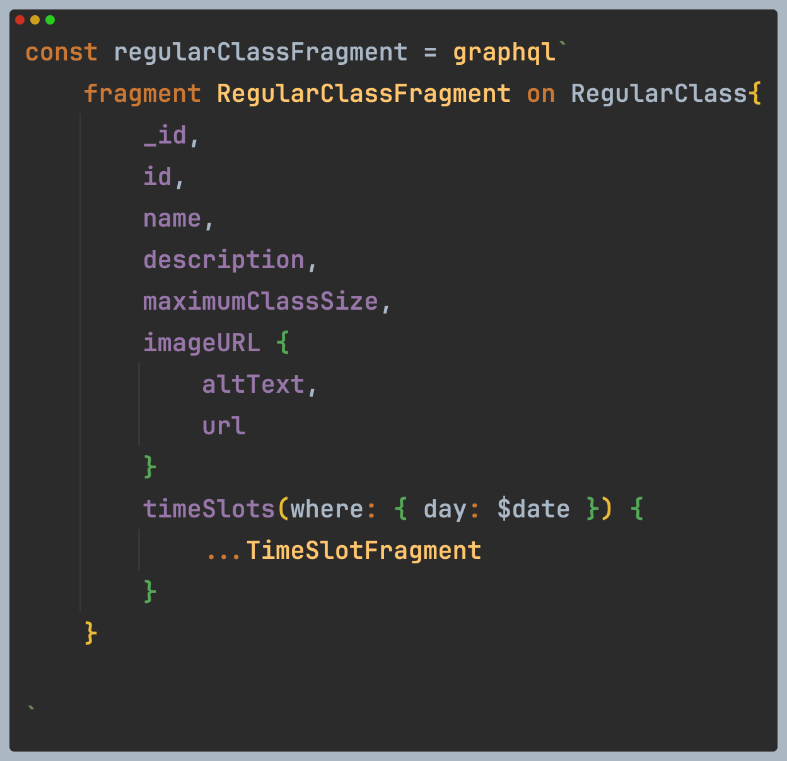

# Relay 어렵지 않나요?

Relay 를 적용하는 과정에서 생각보다 개념적으로 이해가 안되어 어려움을 많이 느끼던 찰나에 relay github에서 다음과 같은 이슈를 발견했다. &#x20;

<figure><figcaption></figcaption></figure>

물론 2016년이라서  그 당시에는 아무래도 지금처럼 문서화는 잘 되어 있지 않았을것이다. 현재의 documentation 은 tutorial 을 제공하며 많은 정보를 주지만 grapqhl자체가 처음인 상태에서  relay docs를 보면 여전히 이해하기 힘들고 러닝커브가 상당히 높다고 느꼈졌다.&#x20;

나뿐만이 아니라는 생각이 아니구나 라는 안도(?) 감이 있었으나 바로 다음의 스레드를 보고 다시한번 이 기술을 생각해보자라는 생각이 들었다.


<figure><figcaption></figcaption></figure>


깊이는 얕을 수 있지만 Relay를 배우면서 이해하기 어려웠던 부분에 대해  작성 해보기로 했다.&#x20;


Relay에서는 쿼리와 프래그먼트를 명확히 나누는 것이 핵심라고 생각한다. 프래그먼트는 UI데이터를 제공하고, 쿼리는 데이터 fetching로직을 정의한다.


프래그먼트는 컴포넌트 내에서 사용되는 데이터 타입을 정의 하는데 Relay의 usePaginationFragment에 넘겨서&#x20;


프래그먼트를 사용하기 전까진 props로 내려줘서 React 를 사용하는것과 다를게 없었다.

relay를 사용하는 것에 대한 특별한 이점을 얻질 못했다.

```tsx
// Some code
type StoreProps = {
  storeId: string
}
const storeQuery = graphql`
    query StoreQuery($storeId: String!){
        stores(where: {_id: $storeId}){
            _id
            name
            description
        }
    }
`

export const Store = ({ storeId }: StoreProps) => {
  const data = useLazyLoadQuery<StoreQuery>(storeQuery, { storeId })
  console.log('store component data', data)
  return (
    <div>
      <h1>Store Component</h1>
      <StoreDetail name={} description={}/>

    </div>
  )
}

export const StoreDetail = ({name, description}) => {
  const [storeInfoOpen, setStoreInfoOpen] = useState(false)
}
  return (<>

    <StoreDetailDrawer storeInfoOpen={storeInfoOpen} setStoreInfoOpen={setStoreInfoOpen}
  </>)
}
```


props로 전달과 relay fragment사용 차이점 정리&#x20;

* **데이터 vs 참조**
  * 일반 props: 실제 데이터를 직접 전달
  * Relay props: fragment에 대한 참조(reference)를 전달
* **데이터 일관성**
  * useFragment는 Relay의 store에서 최신 데이터를 가져옴
  * 데이터가 업데이트되면 자동으로 컴포넌트 리렌더링
* **데이터 요청 최적화**
  * Relay는 필요한 데이터만 서버에서 가져오도록 최적화
  * 중복 데이터 요청 방지

***

이제 fragment에 대해 좀 알게 되었다.

그럼 RegularClasses 가 있는데, 여기에는 pagination이 적용되어 argument가 있다.

이건 어떻게 다뤄야 할까? &#x20;

1. arguments를 쿼리 레벨에서 전달하는 방법&#x20;
2. fragment에서 직접 argument정의하기&#x20;


***


### 오늘 업데이트&#x20;

충격이다. relay가 여태까지 내가 고민하고 있던 포인트를 해결해주었다.&#x20;

매번 웹소켓을 달아야 하나 어쩌나 하면서 고민을 두고 있었는데, relay가 마침 이 고민을 해결해 줄 수 있다는 희망을 보게 되었다.&#x20;

사장님은 유동적으로 클래스를 온, 오프 하기를 원했다. 물론 기능은 있다 오프를 하면 db는 바로 없데이트가 된다. 문제는 클라이언트 쪽인데 현재는 swr를 사용하고 있어 유저가 마우스를 클릭 하거나 터치를 하게 되면 그때서야 리페칭이 일어난다. 이건 실시간과는 조금 거리가 있다. &#x20;

나는 설레는 마음으로 당장 relay를 시작해보았다. 그리고 이런 문제는 항상 고민하던 것이었다.&#x20;

자 지금부터 한번 해보자 화이티이! 넌 오늘 내로 pagination을 완성하고, 실시간 업데이트도 확인할 수 있을거야&#x20;

그리고 나면 내일부터는 이력서에 이부분을 업데이트할거야. \
그리고 제출을 할거야! wconcept , 라포랩스 지원해보자! 화이팅 !!!&#x20;


알고보니 자동으로 되는데 아니였다.

Relay는 Subscription을 통해 서버-클라이언트 간 실시간 데이터 동기화에 강점을 가지며, Redux는 클라이언트 내부의 상태 관리를 더 자유롭게 제어할 수 있습니다. 서버의 데이터 변경 사항을 자동으로 감지하려면, Relay에 Subscription(WebSocket)을 추가해야 합니다.


"Relay는 GraphQL API를 통해 서버 데이터와의 동기화에 강점을 가지며, Redux는 클라이언트 내 로컬 상태 관리에 강점을 가집니다. Relay는 Subscription을 통해 서버 데이터 변경 사항을 자동으로 갱신할 수 있지만, Redux는 Polling, EventSource와 같은 추가 로직이 필요합니다."


ㄴ

#### **1. 예약 어플리케이션에서 관리자(Admin)가 "on\_sale" 상태를 off로 변경한 경우**

**(1) Relay 사용 시**

* 운영자가 Admin 페이지에서 **on\_sale**을 **off로 변경**하면,
* **Relay의 Subscription**이 이를 감지하고,
*   예약 화면의 UI에 있는 **해당 클래스의 상태가 즉시 업데이트**됩니다.

    > **서버 → 클라이언트 (자동 업데이트, 실시간)**

**(2) React Query 사용 시**

1. **Polling 방식**
   * React Query의 Polling 기능을 통해 **n초마다 데이터를 다시 요청**합니다.
   * 예약 페이지는 일정 간격으로 API를 요청하므로,
   * **서버 변경 사항이 UI에 반영되지만 실시간으로 즉시 변경되지는 않습니다.**
2. **Invalidate 방식**
   * 운영자가 특정 동작을 수행했을 때, `queryClient.invalidateQueries("classes")`를 호출합니다.
   * 이로 인해 **React Query가 캐시에 있는 데이터를 무효화**하고,
   * API에 다시 요청을 보내어 **갱신된 데이터를 가져와 UI를 업데이트**합니다.

> **결론**:\
> Relay의 **Subscription을 통한 즉각 반영**과 React Query의 **Polling 또는 수동 무효화** 방식은 다른 접근 방식입니다.\
> 실시간성을 원한다면, **Relay + Subscription**이 더 적합하고,\
> 약간의 지연이 허용된다면 **React Query + Polling**도 충분히 사용할 수 있습니다.


***

### Today업데이트&#x20;

fragments 사용법에 대해 익숙해 지려고 하는데 `useFragment`와 관련된 타입 문제와 `fragment`의 연결 부분에서 혼란이 생겼다.

왜 혼란이 생기는지 보니 props로 주고 받는 RegularClassFragment$key 와 $fragmentSpreads를 정확하게 모르고 있어 헤매였다.


$fragmentSpreads 는 Relay타입시스템에서  프래그먼트 타입을 명확히 정의해한다. graphql로 정의된 프래그 먼트는 어떤 데이터를 포함하는지 명확히 해 useFragment로 사용할 때 타입이 맞는 데이터를 전달해 오류를 방지할 수 있다.

```
// Some code
fragment TimeSlotFragment on TimeSlot {
  id
  startDateTime
  status
}
```

Relay는 이를 바탕으로 타입스크립트 타입을 생성한다.

```
// Some code
export type TimeSlotFragment$key = {
  readonly " $data"?: TimeSlotFragment$data; 
  readonly " $fragmentSpreads": TimeSlotFragment$fragmentType;
};

```

* **`$fragmentSpreads`**: 이 타입은 **TimeSlotFragment**라는 프래그먼트의 데이터임을 나타내며, 이 데이터가 프래그먼트를 따르는지 타입 체크를 강제합니다.
* 그러니깐 어떤 컴포넌트든 TimeSlotFragement 데이터를 이용할거면, props 로`TimeSlotFragment$key`  (프래그먼트 키 ) 타입을  내려 받고, 이 키 타입내의 spreads를 통해 전달된 데이터가 올바른 프래그먼트인지 체크한다.&#x20;
* 프래그먼트 키를 사용하지 않으면 스키마가 변경 되었을 때 오류를 미리 감지하지 못하고 자동완성기능도 활용하지 못해 부모컴포넌트에서 잘못된 데이터를 전달해 자식컴포넌트가 예상치 못한 동작을 할 수 있다.
*

    <figure><figcaption></figcaption></figure>


```typescript
// RegularClass.tsx
  <TimeSlots timeSlots={data.timeSlots} />
  // data.timeSlots의 타입은 TimeSlotFragment의 array형식이다. 


//type
export type RegularClassFragment$data = {
  readonly _id: string;
  readonly description: string;
  readonly id: string;
  readonly imageURL: {
    readonly altText: string | null;
    readonly url: string;
  } | null;
  readonly maximumClassSize: number;
  readonly name: string;
  readonly timeSlots: ReadonlyArray<{
    readonly " $fragmentSpreads": FragmentRefs<"TimeSlotFragment">;
  }> | null;
  readonly " $fragmentType": "RegularClassFragment";
};
export type RegularClassFragment$key = {
  readonly " $data"?: RegularClassFragment$data;
  readonly " $fragmentSpreads": FragmentRefs<"RegularClassFragment">;
};

// TimeSlots.tsx

type TimeSlotsProps = {
  timeSlots: ReadonlyArray<TimeSlotsFragment$key> //여기에 와야 하는 타입은 위에서 내려준 TimeSlotFragement의 array형태 
}

export const TimeSlots = ({ timeSlots }: TimeSlotsProps) => {
  return ( //timeSlots가 fragment레퍼런스들로 이루어져 있어, 레퍼런스를 바로 넘겨줄 수 있다. 
    <>{timeSlots.map((timeSlot, idx) => <TimeSlot key={idx} timeslot={timeSlot} />)}</>
  )
}

```

