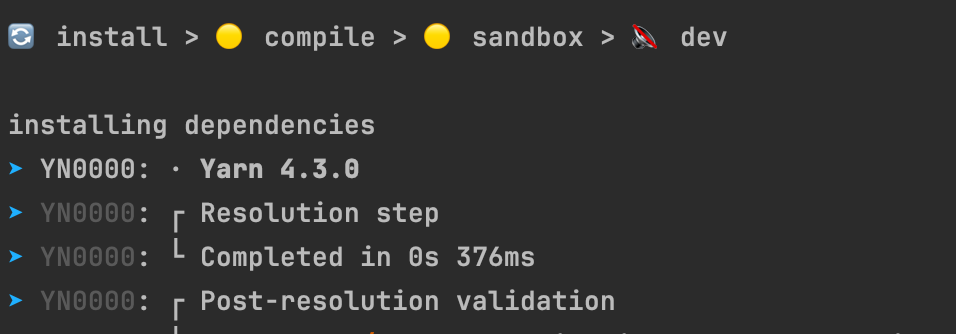

# Yarn 과의 전쟁 : Storybook 오픈 소스 기여중입니다.

Storybook은 기본적으로 yarn 패키지 매니저 4.0 이상의 버전을 사용한다.

<figure><figcaption></figcaption></figure>

corepack enable 을 해줘야 한다.&#x20;

<figure><figcaption></figcaption></figure>

```
yarn start
```

이 에러는 Yarn의 Plug'n'Play (PnP) 기능이 필요한 의존성들을 찾지 못해서 발생하고 있습니다. 스토리북의 core 패키지에 react, @emotion/styled 등의 의존성이 명시되어 있지 않은 것 같네요.\


<figure><figcaption></figcaption></figure>
