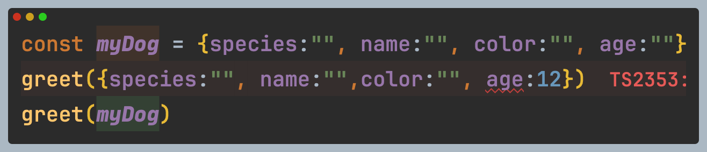

# Freshness

구조적 타이핑 개념을 어느정도 알았다고 느꼈을 때 TypeScript에서 다음과 같은 코드의 동작 차이를 이해하는 것이 처음에는 혼란스러웠다.

```typescript
interface NewDog {
  color: string;
  name: string;
}

// Case 1: 변수에 저장된 객체 할당
const dogg = { color: "", name: "", species: "" };
let newDog: NewDog = dogg; // ✅ 정상 동작

// Case 2: 객체 리터럴 직접 할당
newDog = { color: "", name: "", species: "" }; // ❌ 오류
```


객체 리터럴을 할당하는것과  똑같은 객체리터럴이 할당된 변수(dogg)를 할당하는 것이 같다고 생각했다.


결국 객체리터럴 vs 변수에 저장된 객체의 차이이며 리서치 끝에 정리된 결과는 다음과 같다.




* **객체 리터럴**: 변수를 초기화하면서 객체 리터럴을 사용한 경우와 함수 호출 시점에 즉석에서 생성된 객체로 간주되며, 초과 속성 검사를 엄격히 적용한다. (fresh object)
* **변수에 저장된 객체**: 재사용되거나 다른 곳에서도 사용될 가능성이 있다고 간주되며, 초과 속성을 허용 한다. \
  변수에 저장된 객체가 함수의 매개변수 타입인 인자로 넘겨질 경우 구조적 타입 검사를 수행한다( Loss of freshness)



리서치를 하다 알게된 것이 Freshness 라는 것인데, 사실 이 용어가 TypeScript공식문서에서 서치했을때 찾을 수 없는 것으로 보아 공식적으로 사용되는 용어는 아닌것 같다. 하지만 몇 자료를 통해  상황을 설명하기위해 쓰인 단어로 시작해 퍼진것 같다. \
\




<figure><figcaption></figcaption></figure>


PR 내용에 따르면,

* 모든 객체 리터럴은 처음엔 "fresh(신선한)" 것으로 간주된다.
* Fresh object (신선한 객체 리터럴)가 변수에 할당되거나 타입이 지정되어있는 매개변수에 전달될 때, 타입에 정의되지 않은 속성을 포함하게 되면 존재하지 않는 속성을 지정했다고 오류가 발생한다.
* 이 Freshness(신선함)은 객체 리터럴이 타입 어설션을 사용하거나 객체 리터럴타입이 확장 될 때 사라진다.

여기서 신선한 객체 리터럴은 타입스크립트가 객체 리터럴로부터 추론한 타입을 가리킨다. &#x20;

```typescript
// Some code

let newDog:NewDog = { color: "", name: "", species: "" };
```

여기서 타입스크립트가 추론한 타입은 다음과 같다.&#x20;

```typescript
{
  color: string,
  name: string,
  species: string 
};
```

이렇게 객체 리터럴이 변수에 할당된 경우 초과 속성 검사가 이루어진다.

### 신선함을 이용한 상태

```typescript
interface NewDog {
    color: string;
    name: string;
}

let newDog:NewDog = { color: "", name: "", species: "" }; //❌ 타입에러 

```

newDog에 할당된 객체는 신선한 객체로 취급하고 타입스크립트는 초과 프로퍼티 확인을 수행한 후 버그를 찾아낸다.&#x20;

### 신선함이 사라진 상태

* 객체 리터럴이 myDog라는 변수로 할당되면서 신선한 객체 리터럴 타입은 일반 객체 타입으로 타입이 넓혀 지고  신선함은 사라진다.  &#x20;
* `{species:"",name:"",color:"",age:""}` ->`{species: string, name:string, color:string, age:string} 이렇게 타입이 확장된다.`
* 즉, 변수에 할당된 객체는 초과속성검사를 받지 않는다.&#x20;

<figure><figcaption></figcaption></figure>

* myDog의 객체는 타입스크립트 입장에서는 객체 리터럴이 아니기 때문에 더 많은 속성을 가질 수 있다고 가정한다.
* 그래서 초과속성검사를 하지 않는다.\


### ReactState에서 객체 신선도 사용 사례&#x20;

* 컴포넌트에서 setState를 객체로 호출 할 때, 누락된 속성에 대해 타입에러가 나타난다.

```typescript
// 아래와 같을 때
interface State {
    foo: string;
    bar: string;
}

// 하려고 한 것:
this.setState({foo: "Hello"}); // 오류: 속성 bar 누락

// State에 `foo`와 `bar` 둘 다 있기 때문에 TypeScript에서는 이렇게 할 수 밖에 없음: 
this.setState({foo: "Hello", bar: this.state.bar});
```

```typescript
// Some code
// 아래와 같을 때
interface State {
    foo?: string;
    bar?: string;
}

// 하려고 한 것: 
this.setState({foo: "Hello"}); // 좋아, 잘 되는군!

// 신선도 때문에 오타 입력은 방지됨!
this.setState({foos: "Hello"}); // 오류: 객체 리터럴은 정의된 속성만 지정해야 함

// 타입 검사도 유지됨
this.setState({foo: 123}); // 오류: 문자열에 숫자를 할당할 수 없음
```


### 마무리

TypeScript의 설계 철학을 보면 JavaScript의 유연함을 어느 정도 수용하면서도, 정적 타입 검사를 통해 개발자의 실수를 방지하려는 정적 타이핑 도구로서의 책임을 가져가는 것 같다. 객체 리터럴의 "신선도(Freshness)" 개념이 이런 철학을 잘 정말 잘 반영한 사례 인 것 같다.

이런 설계 철학을 이해하지 못한 채 TypeScript를 사용하면,  예상치 못한 타입 에러에 직면하거나 왜 이런 제약이 있는지 많이 혼란스러울 것 같다. 특히 구조적 타이핑과 초과 속성 검사가 상황에 따라 다르게 동작하는 이유를 이해하기 어려울 수 있다고 생각한다.

따라서 TypeScript를 효과적으로 사용하기 위해서 설계 철학의 이해과 함께 타입 시스템의 이점을 최대한 활용할 수 있도록 부단히 노력해야 할 것 같다.


### 참고자료






